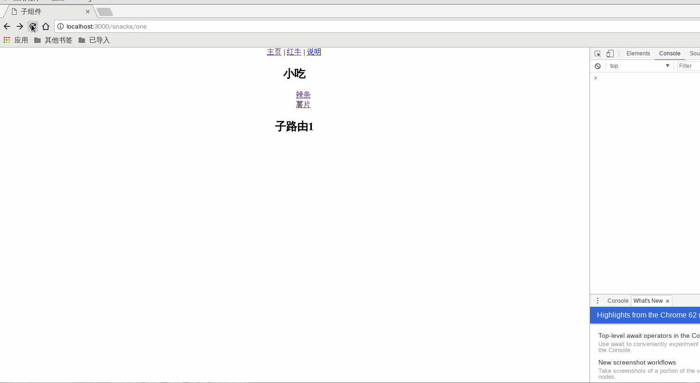

###React version 18.X 版本脚手架
> 包含客户端，使用了最新的react,并实现version 18.X;
> 使用webpack 5.X 来编译
```html
<!-- 分离的第三方依赖 -->
<script src="../dist/js/vendor.js"></script>

<!-- react -->
<script src="../dist/js/app.js"></script>
```
##### 安装命令和一些常用的npm脚本;
- yarn    (安装脚手架依赖)
- yarn preinstall    (检查node版本,最低8.0以上版本)
- yarn prestart    (删除dist 编译打包文件)
- yarn start (启动客户端的开发环境)
- yarn build (打包编译客户端环境,并启动)
- yarn lint (检查代码规范)
- yarn lint:watch (检查代码规范并监听)
- yarn test (启动单元测试)
- yarn test:watch (启动单元测试并监听)
- yarn remove-dist (删除dist文件夹)
- yarn clean-dist (清空dist文件夹)
##### 一些常见问题
1. 刷新之后 404 或者子路由报错；是使用了 BrowserRouter这个路由或者分割了代码。这个路由会开启h5 的history 模式;所以需要nginx的支持; nginx uri 定向到例如是打包文件是通过index.html 就重定向到index.html;如果是放在index.php就重定向到index.php就不会有这个问题了；
2. 这个脚手架是封装了axios 这个ajax库到redux中；所以不用在调用的地方引入axios;只需要在redux的action中使用我在redux中封装的axios 中间件的别名  例如: api.get api.post等就好了;action中也符合redux的方式;
##### (2019.06.10)
1. 移除多余依赖。升级依赖。优化webpack配置
2. 优化嵌套路由写法
##### (2020.11.20)
1. 移除过期依赖。
2. 升级webpack 5
##### (2021.08.12)
1. 移除过时依赖。使用webpack 5自带资源加载
##### (2021.11.11)
1. 升级react-router 为v6.history为 v5.并修改router为hooks写法.
##### (2021.12.24)
1. 升级eslint到8
2. 最低只支持node 14
##### (2022.04.12)
1. 升级为react v18.0
##### (2023.07.22)
1. 添加vite 配置
2. 完善vite 配置
##### (2023.12.04)
1. 升级redux 依赖
#### (2023.12.22)
1. 优化移除redux过时路由之后跳转问题。 以及部分报错问题
##### 示例图片
[ "示例图片")](https://react.zytravel.shop "示例")
#演示
[演示](https://react.zytravel.shop "演示")
##### npm 8 安装命令
`npm i --legacy-peer-deps`
